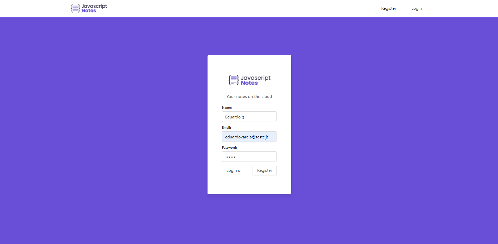
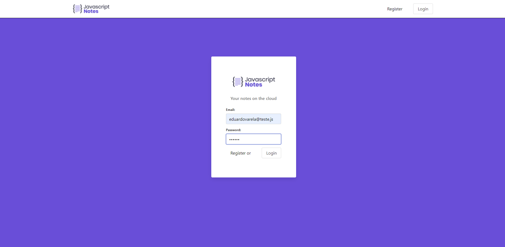
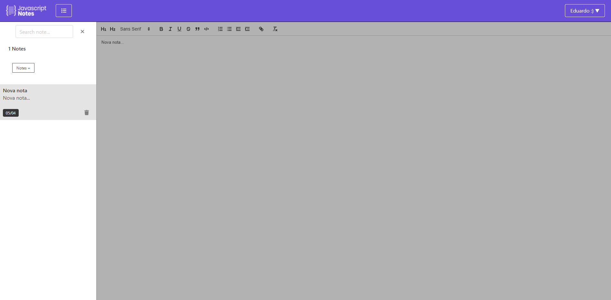
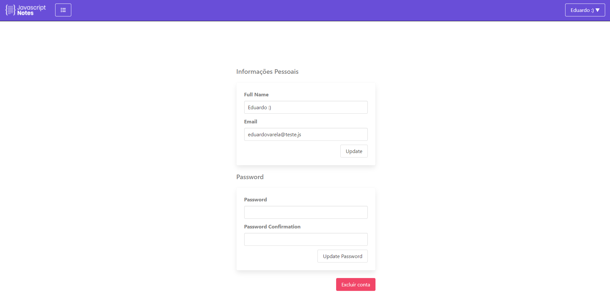

# Notepad Backend

Notepad built using
[React](https://reactjs.org/)
on frontend and
[Node](https://nodejs.org/)
on backend.

Deployed on
[Heroku](https://heroku.com)
and
[Mongodb-atlas](https://mongodb.com/atlas/database)

Click [here](https://js-note-client.herokuapp.com/) to see a demo
HOME                            |  Register                      | Login                     |  Notes                        | Settings
:-------------------------------:|:-----------------------------:|:-------------------------:|:-----------------------------:|:-------------------------:
        |        |   |       | 


## Run locally

```bash
git clone https://github.com/eduardovsousa/JavascriptNotesApi
cd JavascriptNotesApi
npx install
npx nodemon start
```

Frontend:
[https://github.com/eduardovsousa/JavascriptNotesClient](https://github.com/eduardovsousa/JavascriptNotesClient)


## Learn how to do 

<p align="center">
<a href="https://go.hotmart.com/P66380356P">

</a>
</p>


###### **Portuguese language

